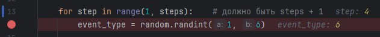
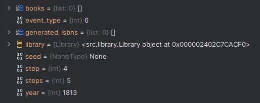
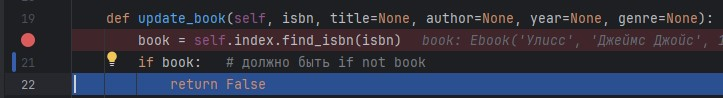
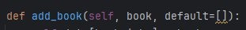
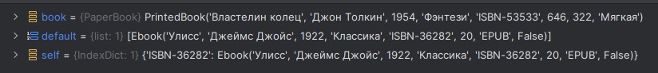
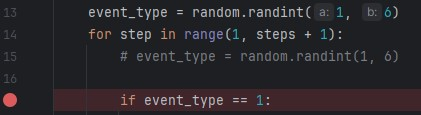
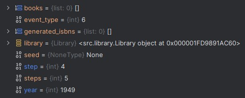
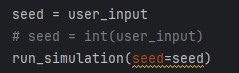
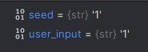

## Ошибка 1 — ошибĸа границы циĸла (off-by-one)

**Место:** simulation.py, метод run_simulation

**Симптом:**
Шагов выполняется на 1 меньше.

**Как воспроизвести:**
Запустить симуляцию с любым seed или просто нажать Enter.

**Отладка:**
Установлен breakpoint в теле цикла.
В отладчике видно, что последняя итерации происходит с step = 4.

**Причина:**
Использована неверная граница в range.

**Исправление:**
Заменено на:
range(1, steps+1)

**Проверка:**
Количество шагов совпадает с заданным.

**Доказательства:** 

## Ошибка 2 — неверное логическое условие

**Место:** library.py, метод Library.update_book

**Симптом:**
Книга никогда не обновляется.

**Как воспроизвести:**
Запустить симуляцию с seed или просто нажать Enter.

**Отладка:**
Установлен breakpoint в начале функции.
В отладчике видно, что первое условие выполняется и выполняется return False.

**Причина:**
Забыт 'not'

**Исправление:**
if not book

**Проверка:**
Книги корректно обновляются.

**Доказательства:** 

## Ошибка 3 — изменяемое значение по умолчанию

**Место:** collection.py, метод IndexDict.add_book

**Симптом:**
Книги добавляются сразу всем авторам и годам.

**Как воспроизвести:**
Запустить симуляцию с любым seed или просто нажать Enter.

**Отладка:**
Установлен breakpoint в теле функции.
В отладчике видно, что при создании используется непустой default.

**Причина:**
Используется default=[], который создается один раз.

**Исправление:**
Заменено на default = None.

**Проверка:**
Индекс строится корректно.

**Доказательства:** 

## Ошибка 4 — ошибка состояния

**Место:** simulation.py, метод run_simulation

**Симптом:**
Вызывается одно и то же событие все разы.

**Как воспроизвести:**
Запустить симуляцию с любым seed или просто нажать Enter.

**Отладка:**
Установлен breakpoint в теле функции.
Видно, что событие выбираетяс один раз перед циклом и не обновляется после этого.

**Причина:**
Событие выбирается перед циклом, а не в нём.

**Исправление:**
Выбор события перенесен в цикл.

**Проверка:**
Вызываются различные события.

**Доказательства:** 

## Ошибка 5 — неправильный разбор входных данных

**Место:** main.py, метод main

**Симптом:**
Не устанавливается seed.

**Как воспроизвести:**
Запустить симуляцию с любым одинаковым seed несколько раз.

**Отладка:**
Установлен breakpoint на вызов run_simulation.
Видно, что в него передается строковый seed, вместо ожидаемого числового.

**Причина:**
Пользовательский ввод не преобразован в int.

**Исправление:**
Пользовательский ввод преобразуется в int перед передачей в run_simulation.

**Проверка:**
При запуске с одинаковым seed генерируются одинаковые события.

**Доказательства:** 

